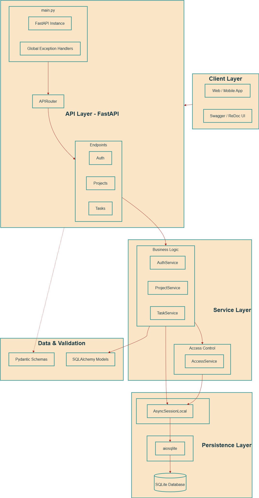

# Team Tasks Manager - Backend

A high-performance, asynchronous REST API for managing team projects and tasks. Built with FastAPI and designed for scalability and professional deployment.

## 🚀 Key Features

- **Asynchronous Architecture**: Fully non-blocking database operations using `SQLAlchemy` 2.0 and `aiosqlite`.
- **Centralized Error Handling**: Standardized API responses and global exception mapping (400/403/500).
- **Proactive Persistence**: Automatic schema migrations and table creation on application startup.
- **Robust Security**: JWT-based authentication with OAuth2 password flow.
- **Docker-Ready**: Multi-stage Docker builds powered by `uv` for minimal image size and fast dependency resolution.
- **Easy Orchestration**: `docker-compose` support with managed environment variables and volume persistence.

## 🛠 Tech Stack

- **Framework**: [FastAPI](https://fastapi.tiangolo.com/)
- **Database**: SQLite (via `aiosqlite`)
- **ORM**: [SQLAlchemy 2.0](https://www.sqlalchemy.org/)
- **Validation**: [Pydantic v2](https://docs.pydantic.dev/)
- **Package Manager**: [uv](https://github.com/astral-sh/uv)
- **Server**: Uvicorn

## 📋 Prerequisites

- **Python**: 3.13+
- **uv**: (Recommended) Installed on your machine.
- **Docker**: (Optional) For containerized execution.

## 🏃 Running the Application

### Option 1: Local Development (via `uv`)

1. **Install Dependencies**:
   ```bash
   uv sync
   ```

2. **Configure Environment**:
   Copy the example environment file and update the values:
   ```bash
   cp .env.example .env
   ```

3. **Run the Server**:
   ```bash
   uv run uvicorn app.main:app --reload
   ```
   The API will be available at [http://localhost:8000](http://localhost:8000).

### Option 2: Docker Compose (via `docker`)

1. **Start the Stack**:
   ```bash
   docker-compose up -d
   ```
   
2. **Access the API**:
   The backend is exposed at [http://localhost:8000](http://localhost:8000).

## 📖 API Documentation

Once the server is running, you can explore the interactive API documentation:
- **Swagger UI**: [http://localhost:8000/docs](http://localhost:8000/docs)
- **ReDoc**: [http://localhost:8000/redoc](http://localhost:8000/redoc)

## 🏗 System Architecture



The application follows a clean, layered architecture to ensure a strict separation of concerns and maintainability.

### 1. API Layer (FastAPI)
- **Entry Point**: `main.py` initializes the FastAPI application.
- **Global Error Handling**: Integrated exception handlers map Python-level errors (e.g., `PermissionError`) to standardized HTTP responses.
- **Routing**: Optimized using `APIRouter` to modularize endpoints.
- **Dependency Injection**: Handles database session provisioning and JWT-based user authentication.

### 2. Service Layer (Business Logic)
- **Business Logic**: Decoupled from the API layer to allow for easier testing and reuse.
- **Access Control**: A specialized `AccessService` performs granular checks on project and task permissions based on roles (Owner, Member, Creator).
- **Asynchronous Execution**: All services operate using `async/await` for high-concurrency performance.

### 3. Data & Validation Layer
- **Pydantic Schemas**: Define the external API contract, ensuring strict data validation and type safety for all requests and responses.
- **SQLAlchemy Models**: Define the internal database schema, relationships, and constraints.

### 4. Persistence Layer
- **Async Driver**: Uses `aiosqlite` for non-blocking I/O operations with the SQLite database.
- **Session Management**: Managed via an `AsyncSession` factory, ensuring efficient transaction handling.
- **Data Persistence**: Dedicated `/data` volume for persistent storage in containerized environments.

## 📁 Project Structure

```text
├── app/
│   ├── api/          # API Route definitions & Endpoints
│   ├── core/         # Configuration, Dependencies, Utilities
│   ├── db/           # Session management & Database Base
│   ├── models/       # SQLAlchemy models
│   ├── schemas/      # Pydantic schemas (Request/Response)
│   ├── services/     # Business logic layer
│   └── main.py       # FastAPI application entry point
├── data/             # Persistent SQLite database storage
├── Dockerfile        # uv-powered multi-stage build
└── docker-compose.yml# Service orchestration
```

## 🔐 Configuration

The application is environment-driven. Key variables available in `.env`:
- `DATABASE_URL`: Location of the SQLite database.
- `SECRET_KEY`: Used for JWT signing.
- `BACKEND_CORS_ORIGINS`: Allowed frontend origins.
- `BACKEND_PORT`: Host port mapping for Docker.
